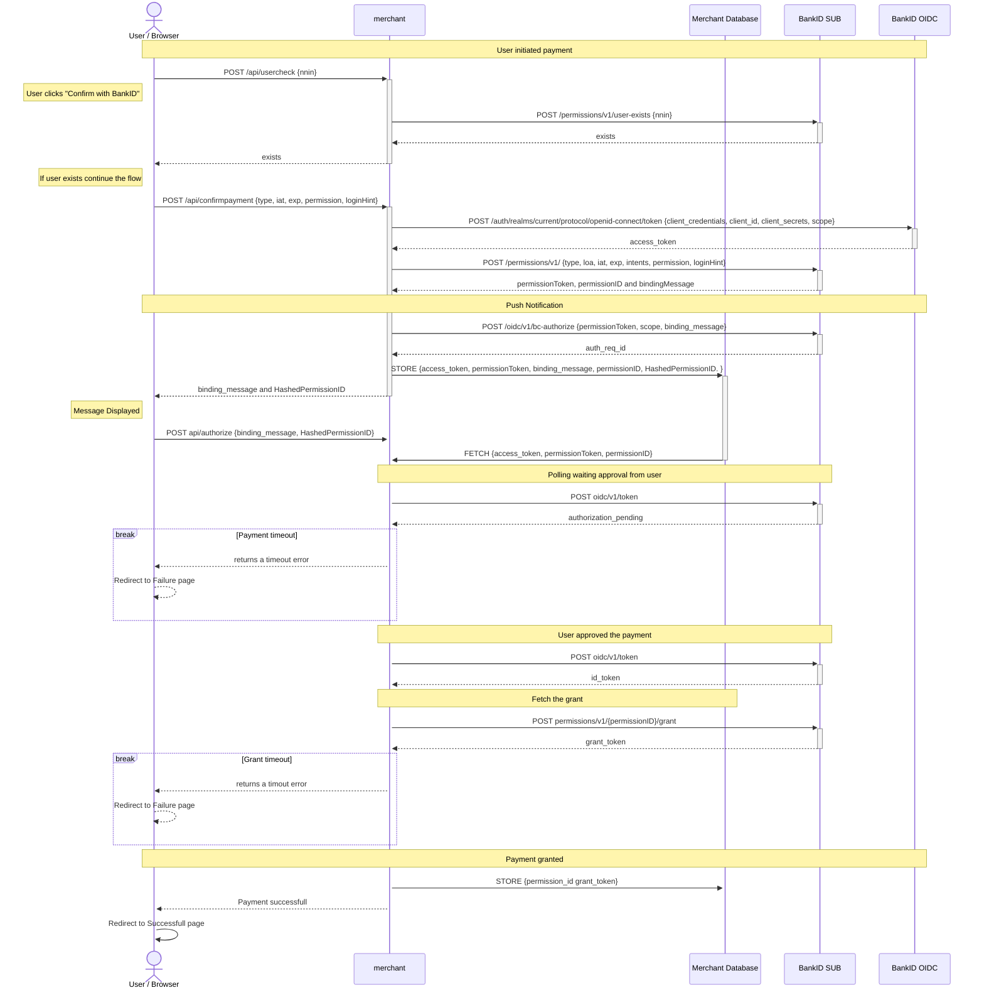

# CIBA flow example application

This application is a simple example of integrating BankID with Biometrics into a payment system using the CIBA flow. We
will create a payment permission based on user action, and have this permission granted using the CIBA flow.

This example demonstrates how to implement the different calls to the BankID with Biometrics APIs in order to
successfully implement the CIBA flow.

## Prerequisites

1. [Node.js](https://nodejs.org/en/) v18 LTS
2. [pnpm](https://pnpm.io/) v8
3. [dotnet](https://dotnet.microsoft.com/en-us/download) v6
4. [Docker](https://www.docker.com/)

## Getting started with Docker

1. You need to request merchant client credentials from [BankID](https://developer.bankid.no/bankid-with-biometrics/testing/).

2. Navigate to [backend/app](/example-ciba-flow/aspnet-and-nextjs/backend/app/) and make a copy
   of `appsettings.example.json` to `appsettings.json`. You need to replace the following values with your own
   credentials:

- `BANKID_CLIENT_ID` the merchant client id.
- `BANKID_CLIENT_SECRET` the merchant client secret.

Now you should be good to go!

Navigate back to the [root](/example-ciba-flow/aspnet-and-nextjs/) folder where the `docker-compose.yaml` resides.

```bash
docker compose up --build --remove-orphans
```

Now you should be able to open a browser at `http://localhost:3000` to test out the application.

## Run the project locally without Docker

You can run the project locally without using docker. However, there are more steps involved.

1. Navigate to [backend/app](/example-ciba-flow/aspnet-and-nextjs/backend/app/) and install the dependencies.
    ```bash
    cd backend/app
    dotnet restore
    ```

2. Run the backend
    ```bash
    dotnet run
    ```

3. Navigate to the [frontend](/example-ciba-flow/aspnet-and-nextjs/frontend/) and run the following:
    ```bash
    cd frontend
    pnpm install
    pnpm dev
    ```

Now you should be able to open a browser at `http://localhost:3000` to test out the application.

## Folder Structure

- [backend](backend) - The backend written in ASP.NET.
- [frontend](frontend) - The frontend written in Next.js.
- [docker-compose.yaml](docker-compose.yaml) - The docker-compose file used to run the project. This will automatically
  build the docker images for the backend and frontend.

## How does this work?

The following diagram illustrates the example application that integrates with BankID with Biometrics' CIBA flow.



For more details and a tutorial on how to implement the CIBA flow
see https://developer.bankid.no/bankid-with-biometrics/flows/ciba/.

## Considerations

This example application is not production-ready. It is meant to be used as a reference for how to integrate with
BankID. The following considerations should be taken into account when using this example application:

- The user controls the payment amount. This is not a good practice in a production environment. The merchant should
  rather control the payment amount, for example when performing bank payments, approving a card payment initiated by
  another merchant, etc.

- The polling mechanism is not robust. It is meant to be used as a reference for how to implement the CIBA flow. In a
  production environment, the merchant should implement a more robust polling mechanism to prevent the user from losing
  their session, or eventually their payment authorization.

- The id token and the grant token is currently not validated against JWKs. 
