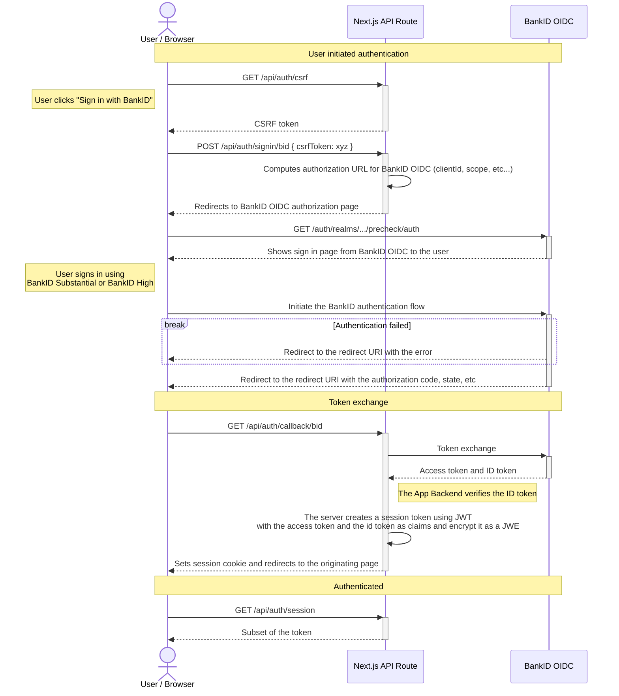

# example-nextjs

An example application integrating with BankID OpenID Connect, built using Next.js.

## Prerequisites

1. [Node.js](https://nodejs.org/en/) 18 LTS
2. [pnpm](https://pnpm.io/)
3. [mkcert](https://github.com/FiloSottile/mkcert)
4. [nss](https://developer.mozilla.org/en-US/docs/Mozilla/Projects/NSS) (Optional; required for Firefox)

## Getting Started

1. [Register a test application for OpenID Connect](https://developer.bankid.no/bankid-with-biometrics/testing/).
    * Use `https://localhost:3000/api/auth/callback` as the redirect URI

2. Copy `.env.example` to `.env.local` and set the values accordingly

3. Install dependencies

   ```bash
   pnpm install
   # or npm install
   # or yarn install
   ```
4. Set up self-signed certificates

   ```bash
   mkcert -install
   mkcert -cert-file certs/localhost.pem -key-file certs/localhost-key.pem localhost
   ```   
5. Run the development server. Note that the development server must run in HTTPS for the redirect URI to work.

   ```bash
   pnpm dev:https
   # or npm run dev:https
   # or yarn dev:https
   ```

## Stack

- [Next.js](https://nextjs.org/)
- [React](https://react.dev/)
- [Tailwind CSS](https://tailwindcss.com/)
- [NextAuth.js](https://next-auth.js.org/)
- [TypeScript](https://www.typescriptlang.org/)

## How Does This Work?

This example uses the [NextAuth.js](https://next-auth.js.org) package to handle authentication.
The following diagram illustrates the entire authentication flow.



We make sure of Next.js API routes, which are serverless functions that can run on the edge.
This allows us to handle the authentication callback without having to run a separate server.

For further details about BankID Substantial authentication flow, see
the [BankID with Biometrics documentation](https://developer.bankid.no/bankid-with-biometrics/home/).

### Project Files

- [route.ts](src/app/api/auth/%5B...nextauth%5D/route.ts) - The API route that handles the authentication callback. This
  is where the authentication mechanism is configured.
- [.env.example](.env.example) - Example environment variables for the OpenID Connect Provider.
- [server.js](server.js) - The server that runs the Next.js application in HTTPS. This is where the self-signed TLS
  certificates are configured.
- [layout.tsx](src/app/layout.tsx) - The layout component that wraps all pages. This is where the SessionProvider is
  configured.
- [page.tsx](src/app/page.tsx) - The index page of the application. This is where the login process is initiated.
